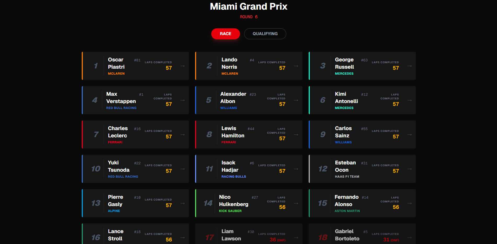

# PitWall

Aplicação full-stack para visualização e análise de telemetria de Fórmula 1.

## Sobre o Projeto

PitWall permite acompanhar corridas, qualificações, pilotos e voltas da F1 com gráficos detalhados e interface moderna.

**Stack:**
- Backend: NestJS + TypeORM + PostgreSQL
- Frontend: Next.js 16.1.1 + React + Tailwind CSS
- Telemetria: Python + FastF1

## Demonstrações




## Pré-requisitos

- Node.js 18+
- PostgreSQL 15+ (ou Docker)
- Python 3.8+ (opcional, para importação de dados)

## Instalação e Execução

### 1. Clone e instale dependências

```bash
git clone https://github.com/PauloHenriqueJunio/PitWall.git
cd PitWall

# Backend
cd backend
npm install

# Frontend
cd ../frontend
npm install
```

### 2. Configure o banco de dados

**Opção A: Docker (Recomendado)**
```bash

docker-compose up -d
```
Isso inicia PostgreSQL (porta 5432) e PgAdmin (porta 8080).

**Opção B: PostgreSQL local**
Configure sua instância e ajuste o `.env`.

### 3. Configure variáveis de ambiente

**Backend** (`backend/.env`):
```env
DB_HOST=localhost
DB_PORT=5432
DB_USER=admin
DB_PASSWORD=admin_password
DB_NAME=pitwall_db
PORT=3000
```

**Frontend** (`frontend/.env.local`):
```env
NEXT_PUBLIC_API_URL=http://localhost:3000
```

### 4. Execute o projeto

**Backend:**
```bash
cd backend
npm run start:dev
```
API: `http://localhost:3000` | Swagger: `http://localhost:3000/api`

**Frontend:**
```bash
cd frontend
npm run dev
```
App: `http://localhost:3001`

## Funcionalidades

- **Calendário de Corridas**: Visualize todas as corridas da temporada
- **Detalhes de Corridas**: Resultados de corrida e qualificação com alternância entre modos
- **Análise de Pilotos**: Gráficos de tempo por volta e estatísticas detalhadas
- **API REST**: CRUD completo para drivers, races e laps
- **Importação de Dados**: Scripts Python para importar dados via FastF1

## API REST

### Endpoints Principais

**Drivers:**
- `GET /drivers` - Lista todos os pilotos
- `GET /drivers/:id` - Obtém um piloto
- `POST /drivers` - Cria um piloto
- `PATCH /drivers/:id` - Atualiza um piloto
- `DELETE /drivers/:id` - Remove um piloto

**Races:**
- `GET /races` - Lista todas as corridas
- `GET /races/:id` - Obtém uma corrida
- `POST /races` - Cria uma corrida
- `PATCH /races/:id` - Atualiza uma corrida
- `DELETE /races/:id` - Remove uma corrida

**Laps:**
- `GET /laps` - Lista todas as voltas
- `GET /laps/:id` - Obtém uma volta
- `POST /laps` - Registra uma volta
- `PATCH /laps/:id` - Atualiza uma volta
- `DELETE /laps/:id` - Remove uma volta

**Documentação completa:** `http://localhost:3000/api` (Swagger)

## Importação de Dados

Scripts Python para importar dados reais da F1:

```bash
cd telemetry

# Importar pilotos
python import_drivers.py

# Importar calendário
python import_calendar.py

# Importar todas as voltas de todas as corridas (QUALY & RACE)
python import_season.py
```

Requer: `pip install fastf1 pandas requests`

## Tecnologias

**Backend:** NestJS, TypeORM, PostgreSQL, Swagger

**Frontend:** Next.js 16.1.1, React 19, TypeScript, Tailwind CSS, Recharts

**Telemetria:** FastF1, Python

**DevOps:** Docker, Docker Compose

## Scripts Úteis

```bash
# Backend
npm run start:dev    # Desenvolvimento
npm run build        # Build
npm run start:prod   # Produção
npm run test         # Testes

# Frontend
npm run dev          # Desenvolvimento
npm run build        # Build
npm run start        # Produção
```

## Estrutura do Projeto

```
PitWall/
├─ backend/          # API NestJS
│  └─ src/
│     ├─ driver/     # Módulo de pilotos
│     ├─ races/      # Módulo de corridas
│     └─ laps/       # Módulo de voltas
├─ frontend/         # App Next.js
│  └─ app/
│     ├─ page.tsx               # Calendário
│     └─ races/[id]/
│        ├─ page.tsx            # Detalhes da corrida
│        └─ driver/[driverId]/
│           └─ page.tsx         # Análise do piloto
├─ telemetry/        # Scripts Python
└─ docker-compose.yaml
```

## Contribuindo

1. Fork o projeto
2. Crie uma branch (`git checkout -b feature/NovaFeature`)
3. Commit suas mudanças (`git commit -m 'Add NovaFeature'`)
4. Push para a branch (`git push origin feature/NovaFeature`)
5. Abra um Pull Request

## Licença

Copyright © 2026 Paulo Henrique Junio.
Todos os direitos reservados.

Este projeto é de uso exclusivo para fins de portfólio e aprendizado. A cópia, redistribuição ou uso comercial deste código sem autorização expressa do autor é proibida.

## Autor

Mantido e desenvolvido por [Paulo Henrique Junio](https://github.com/PauloHenriqueJunio)

---

**Desenvolvido para fãs de Fórmula 1**
